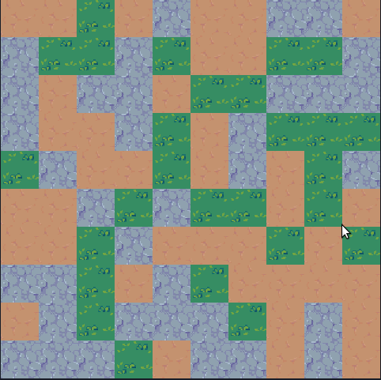

# Flyweight Pattern

> Reference: [Game Programming Patterns — Flyweight](https://gameprogrammingpatterns.com/flyweight.html)



The flyweight pattern shares one copy of an object's *intrinsic* (context-free)
state across many uses, instead of duplicating it. Here a 10×10 `World` is made
of 100 tiles, but every tile points at one of just **three** shared `Terrain`
instances (grass, river, hill) — three objects back a hundred tiles.

Built on **Storm Engine v2**: `Game` runs the loop via a `GameStateMachine`, and
the demo lives in `PlayState`, which draws the world as a textured grid
(`grass.png` / `water.png` / `hill.png`).

## How it works

- `Terrain` holds the shared, immutable state (movement cost, texture, …).
- `World` owns exactly three `Terrain` objects and a grid of *non-owning*
  pointers into them; `generateTerrain(seed)` assigns each tile one of the three.
- `getTile(x, y)` returns a reference to the shared terrain — many tiles, few
  objects.
- Each terrain texture is loaded **once** into the AssetStore and drawn for
  every tile that uses it — a second flyweight layered on the shared `Terrain`s.

The specs prove the sharing: across all 100 tiles there are **at most three**
distinct `Terrain` addresses.

## Build, run, test

```bash
make            # builds ../../bin/flyweight_pattern_example
make run        # draws the terrain grid (Esc to quit)
make test       # igloo specs for Terrain and World
make run-test
```
