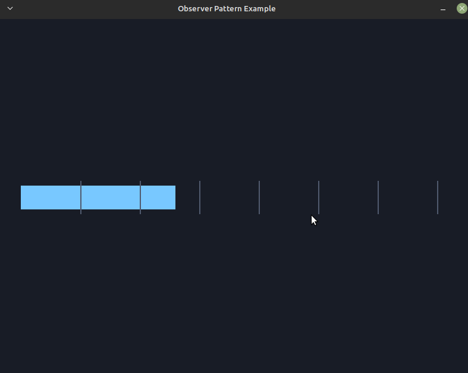

# Observer Pattern

> Reference: [Game Programming Patterns — Observer](https://gameprogrammingpatterns.com/observer.html)



The observer pattern lets one object (the **subject**) tell a changing set of
other objects (the **observers**) that something happened, without being coupled
to what they are or what they do. Add or remove listeners freely; the subject
never changes.

Built on **Storm Engine v2**: `Game` runs the loop via a `GameStateMachine`, and
the demo lives in `PlayState`.

## How it works

- `ScoreObserver` is the interface (`onScoreChanged(int)`).
- `ScoreSubject` owns the score and `notify()`s every registered observer when
  it changes — it knows nothing about them beyond the interface.
- Two concrete observers react to the *same* notification differently:
  - `HudObserver` remembers the latest score for display.
  - `MilestoneObserver` flags whenever the score crosses a new multiple of 100.

This is the "lapsed listener" caveat in action too: `removeObserver` matters, or
the subject would keep notifying a dead observer.

## Controls

| Key | Action |
|---|---|
| Space | Add 10 points (subject notifies observers) |
| Esc | Quit |

The score bar grows (HUD observer); every 100 points the screen flashes gold
(milestone observer).

## Build, run, test

```bash
make            # builds ../../bin/observer_pattern_example
make run
make test       # igloo specs for Subject and observers
make run-test
```
