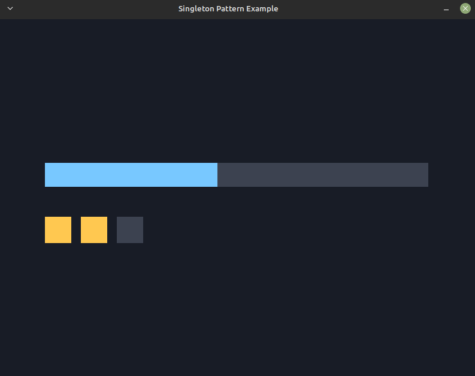

# Singleton Pattern

> Reference: [Game Programming Patterns — Singleton](https://gameprogrammingpatterns.com/singleton.html)



A singleton guarantees a class has **exactly one instance** and gives it a
global access point. Here `Settings` exposes `Settings::instance()`; any code can
read or change the shared volume/difficulty, and there can only ever be one
`Settings`.

Built on **Storm Engine v2**: `Game` runs the loop via a `GameStateMachine`, and
the demo lives in `PlayState`.

## How it works

- `Settings::instance()` returns a function-local `static` ("Meyers singleton"):
  constructed once on first use, thread-safe since C++11.
- The copy constructor and assignment are `= delete`d, and the constructor is
  private — so no second instance can be made.
- `PlayState` holds **no** `Settings` member; it just calls `Settings::instance()`
  to read and mutate the global state.

## Controls

| Key | Action |
|---|---|
| Up / Down | Raise / lower volume (the bar) |
| D | Cycle difficulty (the pips) |
| Esc | Quit |

## A word of caution (from the book)

Nystrom treats this pattern mostly as a *cautionary tale*. A singleton is global
state with extra steps, and it brings the usual problems:

- **Hidden coupling** — any code can reach in and depend on it, invisibly.
- **Hard to test** — state leaks between tests; our `singleton.spec.cpp`
  literally shows this (an earlier test's value is still there in a later one
  unless you reset it).
- **Lazy-init & lifetime** surprises in larger programs.

Prefer passing dependencies in explicitly, or a Service Locator when you truly
need global-ish access. This example exists to understand the pattern — not as a
recommendation to reach for it.

## Build, run, test

```bash
make            # builds the example into the repo-root bin/
make run
make test       # igloo specs for the singleton
make run-test
```
