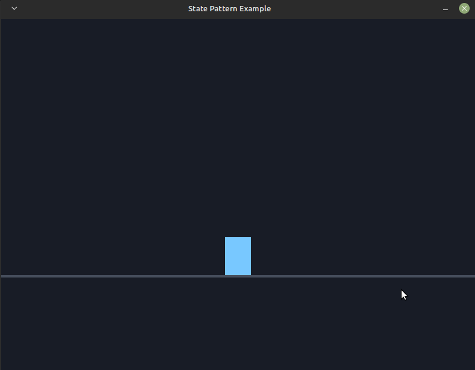

# State Pattern

> Reference: [Game Programming Patterns — State](https://gameprogrammingpatterns.com/state.html)



The state pattern models a character as a **finite state machine**: instead of a
pile of boolean flags (`isJumping`, `isDucking`, …) and tangled `if` statements,
each state is its own class that decides how to react to input and how to
advance over time, handing back the state to be in next.

Built on **Storm Engine v2**: `Game` runs the loop via a `GameStateMachine`, and
the demo lives in `PlayState`.

## How it works

- `CharacterState` is the interface: `handleInput()` and `update()`, each
  returning the next state (`this` for no change).
- `StandingState`, `JumpingState`, `DuckingState` encode the transitions.
  Standing → Jump/Duck; Ducking → Stand; Jumping → Duck (dive), and Jumping
  lands back to Standing on its own via `update()` after `JUMP_DURATION`.
- The states hold no per-character data, so each is a single shared **static**
  instance (the book's "Static States"). Transient data (time airborne) lives on
  the `Character` context.

## Controls

| Key | Action |
|---|---|
| Space | Jump (arcs up, then lands) |
| Down | Duck (short & wide); release to stand |
| Up | Stand |
| Esc | Quit |

The character's colour and shape are derived purely from its current state —
blue standing, green jumping, orange ducking.

## Build, run, test

```bash
make            # builds the example into the repo-root bin/
make run
make test       # igloo specs for the state machine
make run-test
```
